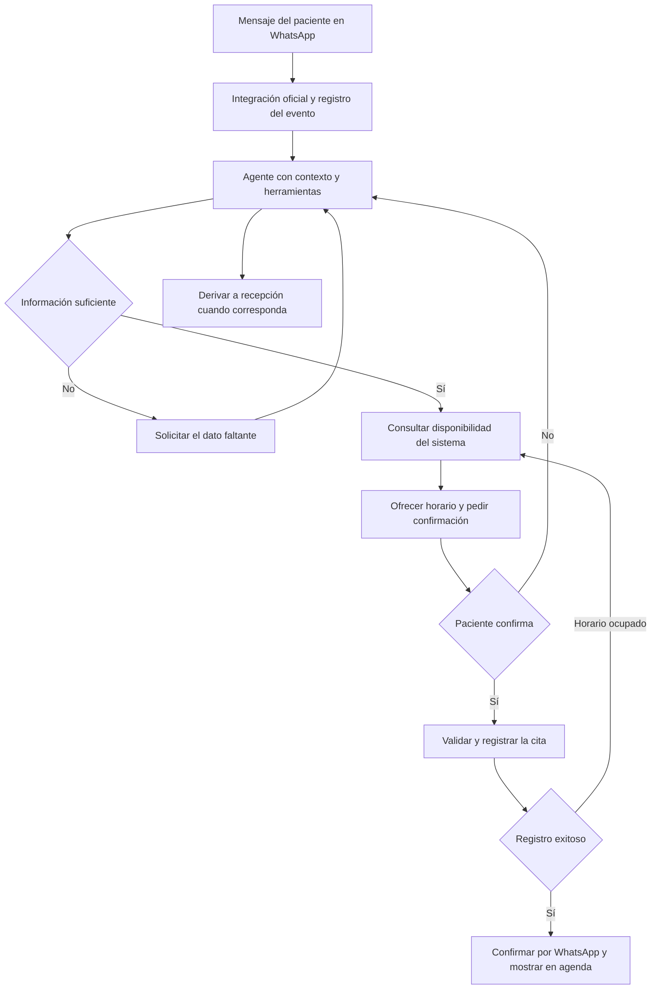

# Alcance confirmado de la primera entrega del sistema odontológico

Fecha de confirmación: 30 de septiembre de 2026. Versión: 1.7. Estado: alcance confirmado por el usuario para la primera entrega. La versión 1.2 incorporó TailwindCSS, arquitectura por capas, listados procesados en el servidor y las instrucciones permanentes de desarrollo. La versión 1.3 registra los ajustes de interfaz del 02/10/2026; la versión 1.4 incorpora los resúmenes de servicios y citas mensuales del 05/10/2026. La versión 1.5 precisa las restricciones del entorno Twilio. La versión 1.6 prioriza el agente antes del upgrade de WhatsApp. La versión 1.7 confirma GroqCloud/openai/gpt-oss-20b por API y las pruebas manuales en la instalación actual con los datos ficticios existentes.

Este documento es la guía funcional y técnica de referencia para elaborar el plan de desarrollo, implementar el sistema y comprobar la primera entrega. Las funciones incluidas son compromisos de esta entrega; las ampliaciones posteriores quedan expresamente fuera de ella. Las decisiones técnicas de prueba adoptadas se distinguen de los requisitos funcionales y pueden ajustarse sin reducirlos.

## 1. Objetivo y alcance del producto

Aplicación configurable para que un odontólogo o un consultorio gestione pacientes, historias clínicas, documentación odontológica, servicios y tratamientos, citas, cobros, pagos parciales y egresos. Incluye obligatoriamente un agente de IA conectado a WhatsApp que pueda completar reservas reales en la agenda del sistema.

La primera entrega está orientada principalmente al registro del sistema y a una demostración funcional verificable. No se desarrolla para un cliente determinado. Se utilizarán datos de demostración y contactos autorizados para las pruebas; la información de identidad, catálogos y reglas se podrá configurar desde la aplicación.

Los datos del consultorio, la marca, los profesionales, el catálogo de servicios, los precios, los horarios y las reglas de reserva se administrarán desde la aplicación. La configuración de un consultorio no debe requerir modificar código.

El ciclo principal será: contacto del paciente → reserva → atención → registro clínico y servicios realizados → cargos y pagos → seguimiento.

Requisitos expresos: pacientes; historial clínico; servicios realizados; archivos odontológicos; ingresos, egresos, saldos y cuotas; agenda; reservas automáticas mediante un agente de IA integrado con WhatsApp.

También forman parte del alcance aceptado: odontograma básico, planes de tratamiento, presupuestos, consentimientos documentales, usuarios y permisos, reportes, auditoría, recordatorios y bandeja de conversaciones con atención humana.

## 2. Configuración y reutilización

Una instalación independiente por consultorio, con su propia base de datos, configuración, usuarios e integración de WhatsApp. Cada instalación tendrá una sola sede y permitirá configurar uno o varios odontólogos. No se incluye una plataforma compartida con múltiples organizaciones ni administración de sedes.

Se asume que cada odontólogo tiene su propio y único sillón. La capacidad de agenda se calcula exclusivamente por odontólogo: no habrá catálogo, asignación ni gestión separada de sillones, salas u otros recursos.

Configuración prevista:

- Nombre comercial, logo, colores, dirección, teléfonos y datos del profesional.
- Moneda principal, zona horaria, formatos de fecha, correlativos y textos de documentos.
- Servicios, precios de referencia, duración, profesionales habilitados y disponibilidad para reserva automática.
- Jornadas por profesional, descansos, días no laborables, ausencias y anticipación mínima de reserva.
- Profesionales activos, sus servicios habilitados y sus horarios; la sede es única.
- Plantillas de historia clínica, categorías de archivos y consentimientos.
- Condiciones de cancelación, reprogramación, cuotas y anticipos, si se utilizan.
- Número de WhatsApp, mensajes autorizados, horarios del agente y casos de derivación.

Los precios y condiciones aceptados por un paciente se conservan en su presupuesto o cargo. Cambiar el catálogo solo cambia las operaciones futuras.

Los valores concretos de horarios, precios, moneda, anticipación y textos no son decisiones pendientes de un cliente. Se proporcionará una configuración inicial de demostración que podrá editarse. La duración de cada servicio es obligatoria, positiva y expresada en minutos.

Todos los módulos que presenten datos en tablas o filas tendrán paginación, filtros y búsqueda textual ejecutados en el backend. El navegador solicita solo la página actual y los totales necesarios; no descarga colecciones completas para procesarlas en memoria. Se limitará el tamaño de página y se validarán los campos de ordenación. Las vistas de calendario consultan intervalos acotados y sus alternativas de lista también se paginan; los menús y textos estáticos no son listados de negocio.

### Diseño visual y experiencia de usuario confirmados

El usuario delega las decisiones de diseño visual al agente. La interfaz debe ser elegante, profesional y atractiva, con una experiencia de usuario clara y consistente. Se diseña principalmente para computadora, aprovechando el espacio para agenda, información clínica y gestión financiera, y se adapta a tablets y celulares para que todas las funciones sigan siendo utilizables.

Se cuidarán jerarquía visual, tipografía legible, espaciado, contraste, acciones principales claras, navegación consistente, formularios comprensibles, estados de carga, ausencia de datos y errores. La marca será configurable y los colores de estado conservarán su significado. Se admitirán teclado en computadora y controles adecuados para interacción táctil.

La adaptación se comprobará en cada fase, incluyendo agenda, odontograma, tablas, formularios, documentos y conversaciones. Las vistas complejas podrán cambiar de disposición o utilizar desplazamiento contenido cuando resulte necesario, evitando desbordamientos de la página y funciones inaccesibles en pantallas pequeñas.

En presupuestos se utiliza «tratamiento» para sus partidas y, en la vinculación de atenciones, «plan de tratamiento». Seleccionar un servicio completa su descripción y precio vigente; el precio unitario sigue siendo editable y se conserva el importe acordado. Los resultados de las acciones se muestran mediante notificaciones flotantes accesibles, con cierre manual y desaparición automática; las validaciones de campo y los fallos que bloquean la carga permanecen en su contexto.

La tabla de odontólogos muestra hasta tres servicios asociados y permite consultar los restantes en un diálogo con búsqueda, filtro de estado y paginación remotos. El mes muestra hasta tres citas por día y «+N citas más» cuando corresponde, manteniendo celdas de altura uniforme. En celular se utiliza un contador para abrir la lista del día. La lista respeta el odontólogo seleccionado, admite búsqueda, estado y paginación del servidor, y abre el detalle existente de cada cita con sus opciones e historial; cerrarlo devuelve a esa lista sin abandonar el mes.

## 3. Pacientes y contacto inicial

Ficha de paciente con código interno, nombres, fecha de nacimiento, datos de contacto, documento cuando corresponda, dirección, contacto de emergencia y observaciones administrativas. Para menores, relación con el tutor o responsable de pago.

La ficha reunirá citas, atenciones, tratamientos, archivos, cargos, pagos y saldo. Tendrá búsqueda, filtros y prevención de registros duplicados.

El número de WhatsApp identifica un contacto, pero no garantiza una identidad clínica única: un padre puede reservar para varios hijos. El agente debe preguntar para quién es la cita y confirmar la relación antes de vincular una ficha existente. Nunca se expondrán historias clínicas o saldos solo por reconocer un teléfono.

Un contacto nuevo que pregunta por precios no necesita convertirse automáticamente en paciente. Se crea una ficha provisional con datos mínimos cuando completa una reserva, y recepción termina el registro antes de la atención.

## 4. Historia clínica y odontograma

Registro longitudinal con antecedentes, alergias, medicamentos informados, anamnesis, evaluaciones, diagnósticos y observaciones del odontólogo. Cada atención tendrá fecha, profesional, motivo, evolución, procedimientos realizados e indicaciones.

Se incluye un odontograma básico que permita registrar por pieza y superficie los hallazgos y tratamientos pertinentes, contemplando dentición temporal y permanente. Debe conservar versiones para poder consultar el estado en distintas fechas.

Los registros clínicos podrán comenzar como borradores. Al finalizarlos, las correcciones se incorporan como nuevas versiones o anotaciones con responsable, fecha y motivo, conservando el original. Cambiar la ficha del paciente no debe reescribir atenciones pasadas.

El registro y la interpretación clínica pertenecen al odontólogo. El agente administrativo de WhatsApp no diagnostica, prescribe ni interpreta estudios.

Se incluyen plantillas clínicas básicas configurables y consentimientos documentales: registrar tipo, fecha, responsable y documento adjunto, con posibilidad de guardar la copia firmada en imagen o PDF. La firma electrónica y la validación legal automatizada quedan fuera de esta entrega.

## 5. Archivos odontológicos

Adjuntos al paciente y, cuando corresponda, a una atención, pieza o tratamiento: radiografías, panorámicas, fotografías, informes, tomografías y otros archivos, incluidas ecografías si el consultorio las utiliza.

Metadatos: categoría, fecha del estudio, descripción, responsable de carga y relación clínica. Funciones: cargar, visualizar los formatos comunes, descargar con autorización y comparar fotografías por fecha.

Formatos iniciales: JPG/JPEG, PNG, WebP y PDF. Se visualizan imágenes comunes y PDF, conservando el archivo original. Estudios que requieran DICOM, archivos tridimensionales o un visor especializado quedan fuera de esta entrega.

El contenido de imágenes y PDF se guardará dentro de la misma base de datos PostgreSQL que los datos del sistema, en columnas binarias `bytea`. No se requiere almacenamiento externo para la primera entrega. PostgreSQL y su controlador JDBC admiten este mecanismo para datos binarios. [Tipos binarios de PostgreSQL](https://www.postgresql.org/docs/current/datatype-binary.html), [Datos binarios con pgJDBC](https://jdbc.postgresql.org/documentation/binary-data/).

Los metadatos y el contenido binario se separarán en tablas relacionadas dentro de esa misma base. Las listas y búsquedas consultarán solo metadatos; el contenido se recuperará al visualizar o descargar un archivo, tras comprobar los permisos. No se guardará el archivo como texto Base64 ni se incluirán todos los adjuntos en la respuesta de una ficha.

Se validarán extensión, tipo real y tamaño. Se adopta como valor técnico inicial un máximo de 20 MiB por archivo, ajustable desde configuración dentro de los límites de la instalación. Se controlará el uso de almacenamiento y los respaldos incluirán datos y archivos en la misma copia de base de datos. El crecimiento de los adjuntos aumenta el tamaño y tiempo de respaldo y restauración; esto debe comprobarse en la validación de la entrega.

## 6. Servicios, presupuestos y tratamientos

Catálogo editable de servicios con precio de referencia, duración, categoría y profesionales habilitados. Solo los servicios expresamente habilitados podrán reservarse mediante el agente.

Plan de tratamiento con procedimientos propuestos, piezas relacionadas cuando corresponda, sesiones, profesional, presupuesto, condiciones de pago y avance. Estados: borrador, propuesto, aceptado, en curso, finalizado y cancelado.

Separaciones esenciales:

- Presupuesto: oferta de precio; no genera cobro por sí mismo.
- Plan aceptado: compromiso de tratamiento y condiciones acordadas.
- Cita: espacio de agenda; no implica que se haya realizado el servicio.
- Atención: trabajo clínico efectivamente registrado.
- Cargo: obligación de pago según las reglas confirmadas a continuación.
- Pago: dinero efectivamente recibido.

Regla de generación de deuda confirmada por el usuario:

- Servicios individuales: se genera el cargo al registrar y finalizar el servicio efectivamente realizado.
- Planes de tratamiento: se generan los cargos al aceptar el plan, con los importes y condiciones de pago acordados. Un presupuesto en borrador o simplemente presentado no genera deuda; aceptar un presupuesto asociado a un plan debe formar parte del mismo acto de aceptación y no generar cargos adicionales.
- Las atenciones o sesiones cubiertas por un plan que ya generó cargos no vuelven a cobrar esos conceptos. Un procedimiento adicional no incluido en el plan se registra como servicio independiente o como una modificación explícita del plan con su ajuste auditable.
- Anular o modificar un plan aceptado exige registrar los ajustes correspondientes, sin borrar pagos ni movimientos anteriores. Se conservan la valoración y los servicios ya realizados.

El estado de aceptación del plan, la generación de sus cargos y su historial deberán guardarse de manera consistente, evitando duplicados ante reintentos. Crear cuotas distribuye una deuda existente; no añade otra deuda por el mismo importe. No se calculan intereses, recargos automáticos ni penalidades monetarias en esta entrega.

Un tratamiento puede tener varias sesiones, y un pago puede cubrir varios cargos. Cancelar una cita no cancela automáticamente un tratamiento ni devuelve dinero.

## 7. Agenda

Calendario por día, semana y mes, con filtros por profesional. Cada cita tendrá paciente o ficha provisional, servicio o motivo administrativo, fecha y hora de inicio y fin, profesional, origen y observaciones. Todos los odontólogos pertenecen a la única sede configurada.

Estados: reservada, confirmada, en espera, en atención, atendida, cancelada y no asistió. Reprogramar conserva el historial de cambios. Las reservas completadas por el agente tras la confirmación del paciente quedan confirmadas automáticamente, sin aprobación obligatoria de recepción.

Reglas de disponibilidad: jornadas, vacaciones, descansos, duración del servicio, tiempo entre citas, anticipación mínima y profesional habilitado. La reserva manual y la reserva por IA deben usar las mismas validaciones.

Al elegir el servicio y la hora de inicio, el sistema calcula automáticamente la hora de fin según la duración configurada y ocupa el intervalo completo para ese odontólogo. Ejemplo: un servicio de 60 minutos que empieza a las 10:00 bloquea de 10:00 a 11:00. Los tiempos de separación configurados también se consideran al buscar disponibilidad.

La duración utilizada queda guardada en la cita. Cambiar la duración del catálogo no modifica silenciosamente citas existentes; reprogramar o modificar una cita requiere comprobar nuevamente el intervalo y cualquier cambio de duración.

La base de datos debe impedir solapamientos para un mismo odontólogo, incluso si recepción y el agente intentan reservar simultáneamente. Odontólogos distintos pueden atender en el mismo horario. Si una cita requiere evaluación para definir el procedimiento, el agente ofrecerá una evaluación inicial configurada.

Se incluye lista de próximas citas, cancelaciones y ausencias. Lista de espera y citas recurrentes quedan como mejoras posteriores.

## 8. Cobros, saldos, cuotas y egresos

Módulo de control financiero del consultorio. La primera versión cubrirá operación diaria y cuentas por cobrar con constancias internas de pago y estados de cuenta descargables en PDF. Estos documentos tendrán identidad del consultorio, correlativo y detalle de la operación. Se podrán adjuntar imágenes o PDF de sustento a ingresos y egresos. Contabilidad formal, declaraciones y facturación electrónica quedan fuera de la primera entrega.

Por paciente:

- Cargos vinculados al tratamiento o servicio, con precio acordado y fecha.
- Abonos con monto, fecha, medio de pago, referencia, responsable y comprobante interno.
- Aplicación de cada abono a uno o varios cargos.
- Anticipos pendientes de aplicar, sin contarlos de nuevo como ingreso al utilizarlos.
- Cuotas con monto, vencimiento, importe pagado y estado.
- Saldo pendiente, cuotas vencidas y estado de cuenta descargable.
- Descuentos, anulaciones y devoluciones con permisos y motivo.

Ejemplo ilustrativo: un paciente acepta un plan por S/ 1 200; se generan cargos por S/ 1 200, paga S/ 300 y posteriormente S/ 200. Se muestran S/ 500 recibidos y S/ 700 pendientes. Realizar después una sesión incluida en ese plan no aumenta la deuda. Un nuevo presupuesto sin aceptar tampoco la aumenta.

El saldo se calcula desde movimientos confirmados y sus aplicaciones. No será un campo libre que se modifique sin explicación. Las correcciones de dinero se realizan mediante movimientos de reversión o ajuste auditable. Se preservan importes y referencias originales, usando cálculos monetarios exactos.

Egresos: fecha, categoría configurable, proveedor opcional, concepto, importe, medio de pago y sustento. Apertura y cierre de caja, cuando el consultorio gestione efectivo, con saldo esperado, saldo contado y diferencias.

Reportes separados: servicios realizados, cargos emitidos, dinero cobrado, egresos y cuentas pendientes. Un presupuesto o servicio a crédito no se presenta como dinero recibido. El resultado de cobros menos egresos se describirá como flujo neto de caja; no como utilidad contable completa.

Una captura de transferencia recibida por WhatsApp no confirma un pago. Lo verifica y registra un usuario autorizado. El agente inicial carecerá de permisos para registrar pagos, modificar deudas o conceder descuentos.

## 9. Usuarios, seguridad y reportes

Roles iniciales configurables: administrador, odontólogo, recepción y caja. Un usuario puede reunir funciones cuando el consultorio es pequeño.

Permisos independientes para consultar historia clínica, descargar archivos, gestionar citas, registrar pagos, efectuar ajustes y administrar la integración. Recepción accede a los datos necesarios para agenda sin acceso clínico completo por defecto.

Auditoría de cambios críticos y accesos a documentación sensible, desactivación de usuarios, copias de seguridad con prueba de restauración y exportación autorizada de información.

Panel de inicio: citas del día, pacientes en espera, conversaciones por atender, cuotas vencidas y cobros del periodo. Reportes por rango de fecha de citas, ausencias, tratamientos, servicios, cobros, egresos y saldos; filtrables por profesional cuando proceda.

La documentación clínica se mantiene dentro del sistema protegido. Para reservas por WhatsApp se solicitan datos mínimos; no se piden documentos de identidad completos ni expedientes médicos. La política oficial de WhatsApp establece límites para identificadores sensibles e información de salud y requiere los avisos y consentimientos aplicables. [Política oficial de mensajes](https://whatsappbusiness.com/policy/).

## 10. Agente de IA y flujo de reserva por WhatsApp

El agente tendrá el objetivo de completar una reserva válida. Podrá comprender lenguaje natural, mantener el contexto administrativo de una conversación, identificar datos faltantes, seleccionar herramientas autorizadas, consultar sus resultados y decidir el siguiente paso. La agenda y las condiciones del consultorio serán su fuente de verdad.

El agente tendrá acceso limitado mediante funciones del sistema: consultar servicios reservables, consultar disponibilidad, buscar o crear un contacto provisional, crear una reserva, consultar las citas propias verificadas, reprogramar, cancelar y derivar a recepción. La creación, reprogramación y cancelación requieren una instrucción explícita del paciente y las comprobaciones de identidad correspondientes.

No tendrá acceso directo a ejecutar SQL ni a modificar libremente la base de datos. Las mismas reglas que usa recepción se validarán en el servidor en cada operación. El modelo interpreta y elige acciones; el sistema comprueba permisos, integridad y disponibilidad.

### Flujo confirmado

1. **Recepción.** WhatsApp entrega un evento de mensaje a la integración. Se valida su autenticidad, se identifica el consultorio por el número conectado y se guarda el evento antes de procesarlo. Se diferencian mensajes entrantes, estados de entrega y mensajes enviados por el propio sistema para evitar bucles.
2. **Control de repetición.** El identificador del mensaje evita procesarlo dos veces. Los eventos se procesan en orden por conversación cuando sea necesario, para que varios mensajes cortos formen una misma solicitud.
3. **Contexto.** Se recupera la solicitud administrativa en curso. Si recepción asumió la conversación, la automatización queda pausada hasta que se devuelva el control.
4. **Comprensión.** El agente distingue reserva, consulta general, confirmación, cambio, cancelación o necesidad de atención humana. Considera negaciones y dudas; mencionar una cita no basta para crearla.
5. **Datos mínimos.** Se confirma para quién es la cita, el tipo de atención reservable, la preferencia de fecha, franja horaria y profesional si aplica. Las fechas relativas se interpretan con la zona horaria del consultorio y se expresan después con fecha y hora completas.
6. **Consulta real.** El agente llama a la herramienta de disponibilidad. El sistema calcula opciones con jornadas, duración y ausencias de cada odontólogo habilitado. El agente solo ofrece opciones devueltas por esa herramienta.
7. **Selección y confirmación.** Se presenta un resumen concreto de paciente, servicio, profesional, fecha, hora y duración. El paciente confirma y se registra automáticamente, sin aprobación previa de recepción. Para simplificar la primera entrega no se retienen horarios mientras el paciente decide: se vuelve a comprobar su disponibilidad al guardar.
8. **Registro.** El agente solicita crear la cita. El servidor vuelve a validar la disponibilidad y guarda la reserva con una clave que impide duplicarla si se repite la solicitud. Si el horario fue ocupado, devuelve el conflicto para que el agente consulte alternativas.
9. **Respuesta.** Solo después del registro exitoso se envía la confirmación con referencia de cita. El envío se conserva como tarea pendiente con reintentos; si falla, la cita permanece registrada y recepción recibe una alerta. Reintentar el envío no vuelve a crear la cita.
10. **Seguimiento.** La cita aparece en la agenda con origen WhatsApp y relación con la conversación. Podrá recibir recordatorios autorizados y gestionar cambios aplicando las mismas reglas.

Estados de una solicitud: información pendiente, opciones ofrecidas, confirmación pendiente, completada, expirada o derivada. Estos estados son diferentes de los estados de la cita, y de los estados de envío o entrega de los mensajes.

Ejemplo ilustrativo, sin disponibilidad real: el paciente escribe «¿Tienen espacio el viernes por la tarde para una limpieza?». El agente consulta el catálogo y la agenda, ofrece opciones válidas y confirma para quién es la cita. El paciente elige una. El servidor registra la reserva y entonces el agente comunica su fecha, hora y referencia. Si solo preguntara «¿cuánto cuesta la limpieza?», recibe la información autorizada y una invitación a reservar, sin generar una cita.

### Casos especiales y límites

- «Mañana en la tarde» requiere convertirlo a una fecha concreta y ofrecer horas disponibles.
- «No me reserves todavía» mantiene la consulta abierta sin crear una cita.
- Un teléfono compartido requiere confirmar al paciente o tutor.
- Mensajes repetidos o confirmaciones tardías no generan citas adicionales.
- Una reprogramación valida y asegura el nuevo horario antes de liberar el anterior; si falla, conserva la cita original.
- Para cancelar, se identifica la cita correcta y se registra el motivo y la confirmación.
- El agente deriva solicitudes clínicas, problemas de identidad, excepciones de agenda, reclamos o mensajes que no pueda resolver. Puede usar un texto de derivación aprobado por el odontólogo ante una posible urgencia; no decide que un caso sea seguro ni impide contactar al profesional.
- Si falla el proveedor de IA, la conversación queda pendiente y visible para recepción. Si falla la agenda, no se comunica una reserva exitosa.
- Las instrucciones recibidas del paciente no pueden cambiar los permisos, consultar otros pacientes ni saltarse validaciones.
- La primera versión procesa mensajes de texto. La transcripción y reserva mediante notas de voz quedan como ampliación posterior.

La integración no consiste en leer todos los chats personales del teléfono. Recibe eventos del número empresarial autorizado. No se debe prometer importación completa del historial previo.

### Bandeja de supervisión y evidencia del agente

Pantalla de conversaciones con estado, paciente o contacto asociado, resumen administrativo, solicitud en curso, cita vinculada y opción de asumir o devolver el control.

Bitácora por ejecución: mensaje de origen, intención estructurada, datos administrativos utilizados, herramientas invocadas, resultados, errores, fecha y referencia de la cita. Se registrarán las versiones del modelo y del flujo, además del consumo y el resultado operacional. No se necesita guardar razonamientos internos del modelo ni enviar el expediente clínico completo al proveedor de IA.

Demostración de aceptación: un mensaje real entra por WhatsApp; el agente interpreta la petición, consulta la disponibilidad con una herramienta, recibe confirmación y crea la cita; esa cita aparece inmediatamente en el sistema y se puede seguir desde la conversación. Además se demuestra que un horario ocupado produce alternativas y que una repetición no crea otra cita.

## 11. Arquitectura y decisiones técnicas de la primera entrega

### Tecnologías confirmadas

| Componente | Decisión |
|---|---|
| Interfaz web | React + Vite + TypeScript + TailwindCSS |
| Servidor y reglas de negocio | Spring Boot |
| Persistencia | PostgreSQL, incluyendo imágenes y PDF en la misma base de datos |
| Agente | Componente propio del backend con contexto persistente y herramientas controladas |
| Evidencia del agente | Bitácora consultable, conversación vinculada y demostración verificable de reserva real |
| Canal inicial de prueba | Integración oficial mediante el entorno Twilio Sandbox para WhatsApp |

La aplicación inicial es web. Un ejecutable de escritorio no forma parte de esta entrega. No se necesita n8n ni un editor visual del flujo. El agente comparte las reglas del backend; no se requiere un microservicio independiente ni una base vectorial para el alcance definido.

### WhatsApp para pruebas

Por la prioridad de sencillez, se adopta Twilio Sandbox como decisión técnica inicial de pruebas. Permite recibir y responder mensajes mediante eventos sin registrar todavía un número de consultorio. Los participantes deben incorporarse al entorno autorizado; utiliza un número compartido, tiene límites de prueba y sus sesiones deben renovarse periódicamente. No es un entorno de producción. Se usará la consola compatible indicada por el proveedor. [Documentación oficial de Twilio Sandbox](https://www.twilio.com/docs/whatsapp/sandbox).

Comprobación vigente al 05/10/2026: Twilio distingue el Sandbox clásico de su nuevo trial con Try out WhatsApp. El nuevo trial restringe los envíos a plantillas del proveedor y no admite respuestas directas TwiML. La primera comprobación permite recibir mensajes reales y enviar una plantilla de prueba; no garantiza texto libre en una cuenta nueva. El agente requiere verificar una cuenta que permita respuestas personalizadas o resolver el proveedor antes de su demostración. Actualizar una cuenta con costes será una decisión expresa del usuario. Se mantienen los criterios de reserva real; una respuesta predefinida no cumple A22. [Restricciones oficiales](https://www.twilio.com/docs/usage/trials/try-out-whatsapp), [guía local paso a paso](conectar-whatsapp-prueba.md).

Se demostrará el agente con mensajes reales desde WhatsApp y citas persistidas en PostgreSQL, además de pruebas internas de sus herramientas. Una conversación simulada o la recepción de un evento ficticio por sí solas no cumplen el criterio de integración completa.

Los recordatorios se probarán usando las plantillas disponibles en ese entorno. Fuera de las 24 horas desde el último mensaje del usuario se requieren plantillas aprobadas; se respetan el permiso de contacto y la atención humana. [Política oficial de mensajes](https://whatsappbusiness.com/policy/).

El conector de WhatsApp estará separado de la lógica de reserva para permitir posteriormente un número empresarial de producción o un proveedor diferente. Conectar el número real de un cliente, conservar su historial o habilitar coexistencia con su aplicación móvil no son requisitos de esta primera entrega.

La configuración de credenciales estará protegida y separada del código y de la bitácora. Antes de realizar pruebas se habilitarán la cuenta de mensajería, los participantes y un punto de recepción HTTPS accesible desde el proveedor. Los mensajes de prueba pueden tener coste; el presupuesto de ejecución se concreta al preparar las cuentas, sin afectar el alcance funcional. [Costes de Twilio](https://www.twilio.com/en-us/whatsapp/pricing).

### Agente y disponibilidad del sistema

El agente será un componente propio dentro del backend Spring Boot. Conservará contexto administrativo, estado de solicitud y bitácora en PostgreSQL, y utilizará un modelo de IA externo capaz de seleccionar herramientas y procesar sus resultados. El proveedor y modelo concretos son decisiones técnicas del plan de desarrollo: se eligen con pruebas de comprensión del español, uso de herramientas, tiempo de respuesta, coste y condiciones de datos. No es necesario entrenar ni alojar un modelo propio para esta entrega.

Decisión confirmada el 06/10/2026: implementar el agente propio en Spring Boot con GroqCloud y openai/gpt-oss-20b mediante API antes de actualizar Twilio. El usuario confirmó que todos los datos actuales son ficticios y autorizó las pruebas en la misma instalación, pacientes y agenda de sistema_odontologo; no se requiere otra instalación ni una agenda separada. Las pruebas automáticas que limpian datos conservan la base de regresión protegida existente. El agente puede procesar mensajes nuevos de WhatsApp y mostrar respuestas preparadas en la aplicación sin enviarlas al teléfono. La cita se crea automáticamente después de confirmar explícitamente el resumen mediante el código de la propuesta; las entradas de la aplicación y sus citas se identifican como pruebas. Esta demostración parcial no cierra A22 ni sustituye la respuesta real por WhatsApp exigida en la primera entrega. [Implementación y evidencia](prototipo-agente-groq-fase-6.md), [configuración y pruebas](configurar-groq-agente.md).

La interfaz y las reglas del agente solo permitirán las funciones descritas en el apartado 10. La confirmación del paciente desencadena el registro automático; la intervención humana se reserva para solicitudes derivadas o cuando un usuario asume una conversación.

La aplicación, PostgreSQL y el procesamiento de mensajes deben estar disponibles durante las pruebas y demostraciones. Cerrar el navegador del usuario no detiene el agente mientras el servidor siga activo. El alojamiento concreto y los accesos se definirán al preparar la ejecución; no hace falta decidir ahora la infraestructura de un cliente futuro.

## 12. Componentes de entrega y exclusiones

La siguiente agrupación define los componentes que debe cubrir la primera entrega completa. El orden de implementación, las tareas y las comprobaciones por etapa se establecerán en el plan de desarrollo posterior.

| Componente | Alcance | Resultado verificable |
|---|---|---|
| Validación temprana de WhatsApp e IA | Conexión de prueba, recepción de mensajes, herramientas de disponibilidad y creación de cita en entorno de prueba | Reserva de principio a fin con un número autorizado, sin pacientes reales |
| Base operativa | Configuración, usuarios, pacientes, catálogo y agenda | Recepción puede gestionar citas sin conflictos |
| Área clínica | Historia, atenciones, odontograma básico, documentos, planes y presupuestos | Se conserva la evolución de un paciente y el avance de su tratamiento |
| Área financiera | Cargos, pagos parciales, anticipos, cuotas, egresos y reportes | Estado de cuenta explicable y corregible con auditoría |
| Integración completa | Agente conectado a los módulos, reprogramación, cancelación, bandeja y recordatorios | Reservas reales con trazabilidad y atención humana disponible |

La IA es obligatoria en la primera entrega completa, aunque su conexión se pruebe antes que el resto de módulos. No se deja como una ampliación opcional.

Ampliaciones posteriores fuera de esta entrega: inventario y alertas de insumos, gestión avanzada de proveedores, múltiples sedes, plataforma compartida para varios consultorios, portal de pacientes, sincronización de calendarios, notas de voz, lista de espera, citas recurrentes, firma electrónica, facturación electrónica, contabilidad formal, visores especializados y ejecutable de escritorio. Cada ampliación necesitará un alcance propio. El proveedor opcional de un egreso sí forma parte del registro financiero básico.

## 13. Criterios de aceptación de la primera entrega

La entrega se comprobará contra esta tabla y contra las reglas de cada módulo. El plan de desarrollo vinculará las tareas y su validación con estos identificadores. La confirmación del alcance no implica que estos criterios ya estén implementados o probados.

| ID | Criterio | Evidencia de cumplimiento |
|---|---|---|
| A01 | Personalización sin modificar código | Editar identidad, moneda, textos, horarios, servicios y precios desde la aplicación y observar el resultado. |
| A02 | Instalación independiente y sede única | Preparar una instalación con su propia base, usuarios y configuración; todas las operaciones pertenecen a esa sede. |
| A03 | Uno o varios odontólogos configurables | Activar al menos dos profesionales con horarios y servicios diferentes; no se exige registrar sillones. |
| A04 | Ficha integral del paciente | Registrar, buscar y consultar sus citas, atenciones, archivos, planes, cargos, abonos y saldo según permisos. |
| A05 | Contactos compartidos y menores | Reservar desde un mismo teléfono para dos pacientes y conservar las relaciones correctas sin revelar datos ajenos. |
| A06 | Historia clínica versionada | Finalizar una atención, corregirla y consultar el registro original, la corrección y su responsable. |
| A07 | Odontograma e historial | Registrar piezas y superficies, incluida dentición temporal, y consultar el estado en dos fechas. |
| A08 | Consentimientos documentales | Registrar un consentimiento y recuperar su imagen o PDF asociado. |
| A09 | Imágenes y PDF dentro de PostgreSQL | Cargar, visualizar y descargar JPG/PNG/WebP y PDF; verificar que su contenido binario está en la misma base. |
| A10 | Protección y límites de archivos | Rechazar tipos y tamaños no permitidos; impedir descarga sin permiso; listar metadatos sin cargar el contenido de todos los archivos. |
| A11 | Presupuestos y planes | Crear, presentar y aceptar un plan; consultar sesiones, condiciones, profesional y avance sin reescribir sus valores históricos. |
| A12 | Duración y agenda por odontólogo | Reservar un servicio de 60 minutos a las 10:00 y bloquear hasta las 11:00; otro odontólogo sí puede atender simultáneamente. |
| A13 | Cambios de catálogo y citas históricas | Cambiar precio y duración de un servicio sin alterar automáticamente presupuestos aceptados, cargos ni citas existentes. |
| A14 | Conflictos concurrentes de agenda | Intentar reservar intervalos solapados para el mismo odontólogo desde recepción y la integración; se admite una de las solicitudes y se rechaza la que produce el solapamiento. |
| A15 | Cargos por servicio individual realizado | Finalizar un servicio suelto y generar su deuda exactamente una vez; reservar la cita no genera ese cargo. |
| A16 | Cargos por plan aceptado | Aceptar un plan por S/ 1 200 y generar esa deuda; completar sus sesiones incluidas no la aumenta; un presupuesto sin aceptar no genera deuda. |
| A17 | Abonos, anticipos y cuotas | Registrar pagos de S/ 300 y S/ 200 sobre S/ 1 200 y obtener S/ 700 pendientes; aplicar un anticipo sin contar dos ingresos y distribuir cuotas sin duplicar deuda. |
| A18 | Ajustes financieros auditables | Corregir un cargo o pago mediante reversión o ajuste con motivo y responsable, conservando el movimiento original. |
| A19 | Constancias internas | Descargar una constancia de pago y un estado de cuenta PDF con identidad, correlativo y detalle; adjuntar un sustento al movimiento. |
| A20 | Egresos y caja | Registrar un egreso con categoría y sustento; abrir y cerrar caja mostrando saldo esperado, contado y diferencia. |
| A21 | Reportes y panel | Consultar citas, ausencias, avance de tratamientos, cobros, egresos, cuotas y saldos por periodo, diferenciando cobros de presupuestos y cargos. |
| A22 | Reserva real por agente de IA | Desde WhatsApp, el agente consulta disponibilidad con herramientas, obtiene confirmación y registra automáticamente la cita en el sistema. |
| A23 | Datos faltantes, consultas y negaciones | Solicitar información ante un mensaje incompleto; no crear citas ante una consulta de precio o «no me reserves todavía». |
| A24 | Idempotencia y recuperación | Repetir eventos o solicitudes sin duplicar citas o movimientos; conservar una cita si falla el envío de confirmación y permitir reintentarlo. |
| A25 | Reprogramación y cancelación | Identificar y confirmar la cita correcta; si falla el nuevo horario, conservar la cita original; guardar historial de cambios. |
| A26 | Atención humana y límites del agente | Asumir una conversación y pausar la IA; derivar consultas clínicas; impedir al agente registrar pagos o modificar deudas. |
| A27 | Bitácora verificable | Seguir desde el mensaje real las llamadas a herramientas, resultados y errores hasta la cita persistida; las credenciales no aparecen en la bitácora. |
| A28 | Recordatorios autorizados | Programar y enviar un recordatorio de prueba usando las condiciones y plantillas admitidas por el entorno; respetar solicitudes de dejar de recibirlos. |
| A29 | Usuarios, permisos y auditoría | Configurar roles, denegar una operación restringida y consultar quién cambió una cita, registro clínico o movimiento financiero. |
| A30 | Respaldo y restauración integral | Restaurar una copia de PostgreSQL y recuperar datos, imágenes, PDF y relaciones entre ellos. |
| A31 | Diseño y experiencia de usuario en computadora, tablet y celular | Revisar todas las pantallas y completar los flujos principales en los tres formatos; comprobar legibilidad, jerarquía, navegación, teclado, interacción táctil, validaciones y ausencia de desbordamientos de página. |
| A32 | Listados procesados en el servidor | En cada tabla o lista de datos, comprobar paginación, filtros y búsqueda textual en la API y PostgreSQL; verificar que el navegador recibe solo la página pedida, con tamaño máximo y ordenación permitida. |

## 14. Registro de decisiones confirmadas

| Tema | Decisión vigente | Origen |
|---|---|---|
| Finalidad inicial | Primera entrega para registrar el sistema y demostrar su funcionamiento; sin cliente específico | Confirmado por el usuario |
| Distribución | Instalación independiente por consultorio | Confirmado por el usuario |
| Sedes | Una sola sede por instalación | Confirmado por el usuario |
| Profesionales y capacidad | Uno o varios odontólogos configurables; cada uno tiene su único sillón y la agenda se controla por odontólogo | Confirmado por el usuario |
| Reservas del agente | Automáticas tras la confirmación del paciente | Confirmado por el usuario |
| Duración | Configurable por servicio; el intervalo completo queda ocupado | Confirmado por el usuario |
| Deuda | Servicios individuales al realizarlos y planes al aceptarlos; sin cobrar de nuevo las sesiones incluidas | Confirmado por el usuario en la aclaración financiera |
| Documentos financieros | Constancias internas; sin facturación electrónica | Confirmado por el usuario |
| Archivos | Imágenes y PDF en la misma base de datos PostgreSQL | Preferencia del usuario adoptada para esta entrega |
| Tecnologías | React + Vite + TypeScript + TailwindCSS, Spring Boot con Java 21 y Maven, y PostgreSQL | Stack confirmado por el usuario; TypeScript, Java y Maven adoptados técnicamente |
| Arquitectura | Backend modular por capas: modelo, repositorio, servicio, DTO y controlador; frontend modular con componentes reutilizables y responsabilidades separadas | Confirmado por el usuario |
| Listados | Paginación, filtros y búsqueda textual ejecutados en el backend; recuperar solo la página solicitada, sin descargar colecciones completas a React | Confirmado por el usuario |
| Guía permanente de calidad | Aplicar el prompt maestro de la raíz en cada fase, con revisión de calidad y sin sobreingeniería; conservar commits en ambos repositorios | Confirmado por el usuario |
| Configuración local | Credenciales PostgreSQL de demostración directamente en application-local.properties; producción y tokens externos usan configuración separada | Excepción explícita autorizada por el usuario |
| Diseño de interfaz | A criterio del agente; elegante, profesional y atractivo, con muy buena experiencia de usuario; prioridad de computadora y adaptación funcional a tablets y celulares | Confirmado por el usuario |
| Terminología y avisos | «Tratamiento» en presupuestos, «plan de tratamiento» en atenciones; precio del servicio autocompletado y editable; notificaciones flotantes para las acciones | Ajustes solicitados por el usuario el 02/10/2026 |
| Resúmenes y consulta completa | Hasta tres servicios por odontólogo y tres citas por día en el mes; diálogos con consulta remota y detalle de cita reutilizado | Ajustes solicitados por el usuario el 05/10/2026 |
| Agente y evidencia | Implementación propia sencilla, bitácora y demostración verificable; sin necesidad de n8n | Criterio del usuario y decisión técnica adoptada |
| WhatsApp de prueba | Twilio Sandbox con participantes autorizados; no se necesita un número de consultorio | Decisión técnica adoptada bajo la prioridad de sencillez del usuario |
| Formatos y tamaño inicial | JPG/JPEG, PNG, WebP y PDF; límite inicial de 20 MiB ajustable | Valores técnicos iniciales adoptados |
| Módulos complementarios | Odontograma básico, presupuestos, planes, consentimientos documentales, usuarios, reportes, auditoría y recordatorios | Propuesta aceptada por el usuario |

No quedan decisiones funcionales pendientes que impidan elaborar el plan de desarrollo. El proveedor y modelo de IA, versiones de dependencias, cuentas y credenciales de prueba, configuración inicial de demostración y entorno de ejecución se resolverán como tareas técnicas del plan. No requieren inventar requisitos de un cliente futuro ni ampliar este alcance.

La implementación y sus comprobaciones se organizan en [el plan de desarrollo](plan-desarrollo-sistema-odontologico.md). Cualquier cambio de alcance autorizado deberá actualizar este documento, el plan y los criterios de aceptación antes de considerarse parte de la entrega.
